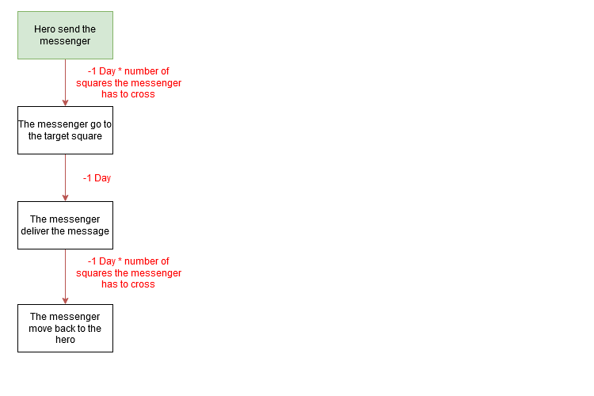

# Game Design Document

## Contents
**I** *- Versions*

**II** *- Product Description*

**III** *- Concept*

**IV** *- Gameplay and mechanics*
* **A** *- Victory condition*
* **B** *- Defeat condition*
* **C** *- 3C*
	* *Camera*
	* *Control*
	* *Character*
* **D** *-Flowshart*
	* *Legend*
	* *Hero*
	* *Messenger*
	* *Square*
* **E** *- HUD*
* **F** *- Level Design*
	* *LD Bricks*
	
	
## Versions
| VX.X | Date       | Title							| Comments																										| Author              |
| ---- | ---------- | ----------------------------- | ------------------------------------------------------------------------------------------------------------	| ------------------- |
| V0.0 | 04/12/2020 | Creation of the documentation	| Create the document and add the summary and product description part											| Matthias de Toffoli |
| V0.1 | 04/13/2020 | Concept						| Add Concept part																								| Matthias de Toffoli |
| V0.2 | 04/18/2020 | Gameplay and mechanics		| Add Gameplay and mechanics parts and add Victory and defeat condition and 3C (Camera and control) parts in it	| Matthias de Toffoli |
| V0.3 | 04/19/2020 | Character and HUD				| Add Character part in Gameplay and mechanics, and add HUD part											   	| Matthias de Toffoli |
| V0.4 | 05/02/2020 | Flowsharts, LD bricks and HUD	| Add Flowshart's legend and Flowsharts for hero, messenger and square, add LD bricks and modify HUD			| Matthias de Toffoli |

## Product Description
* Pitch : It's a 2D mobile mind break game, you will conquer a square that will influence the adjacent squares for conquer them too. An opponent will do same for conquer the all map.
* Platform : Android Mobile
* Tools : Unity, Photoshop
* Targets : Casual gamers
* Localization : English
* 1 Player, 1 Mobile Android required

## Concept
This game will make you control a character who will have to conquere an area by capturing all it squares and fight an opponant who will try to do same.
* Three way to conquere a square (buy it, attack it, or convince its people)
* A square conquered has a level of influence if it level is superior to the squares next to him (not the diagonal) it will influence it and they will be conquered to. This level can be upgrade by an action
* The oponent can have an hero too , yours will can win his territoy by kill him or convince him (you will can convince him with money)
* the way you will conquere the map will influence the story
* optional events can appear on the map, doing it will can help you in the future
* The player will have to manage resources capturing some squares or building some elements on empty squares
* the player will have to chose if he send his hero or a message for an action on a square (time and resources will be different depending of that)
* All actions will take time, the opponent will act during this time
## Gameplay and mechanics
This game is a strategic mind break game, the player will see the map at it top, he will can click on squares he didn't conquer and will can conquest it, by attack, talking or buying. A square conquest will have a level if the player influence more this square so the square will influance the squares next to it.
He can also click on empty squares he already conquer for build elements which will help in his conquest.
The player have an hero, he can send him for doing actions, that will be more efficient but dangerous for his hero. 
The player can also send letters it will be less efficient but more safe for his hero. The player have a number a messages he can send in the same time. 
The hero can also upgrade his influence in a town by his presence or doing optional quest.
All actions take time, in this time the opponent can move and conquer too. The player can pause the time for take decision or let it continue, the action will only be exectuted when the time will throw.
### Victory condition
The player conquer the all map or beat the opponent hero
### Defeat condition
The opponent conquere the all map or beat the player hero
### 3C
#### Camera
Fix 2D top-down
#### Control
Touch only
#### Character
* Conquer an empty square
* attack a square or the opponent's hero
* Buy a square or the opponent's hero
* Convince peoples in a square for make them work for him
* Convince the opponent's hero to give up
* build a simple village on an empty square for food
* send messages for do the previous actions.
* go to a village for increase his position in it
### Flowshart
#### Legend

#### Hero

#### Messenger

#### Square

### HUD
* *Red are actions*
* *Blue are indications*

### Level design
#### LD Bricks

square took by no side

square took by the player

square took by the oponent