# Game Design Document

## Contents
**I** *- [Versions](#versions)*

**II** *- [Product Description](#product-description)*

**III** *- [Concept](#concept)*

**IV** *- [Gameplay and mechanics](#gameplay-and-mechanics)*
* **A** *- [Victory condition](#victory-condition)*
* **B** *- [Defeat condition](#defeat-condition)*
* **C** *- [3C](#3c)*
	* *[Camera](#camera)*
	* *[Control](#control)*
	* *[Character](#character)*
* **D** *-[Flowchart](#flowchart)*
	* *[Legend](#legend)*
	* *[Hero](#hero)*
	* *[Square](#square)*
* **E** *- [UI](#ui)*
	* *[Interaction](#interaction)*
	* *[Legend](#legend-1)*
	* *[Start screen](#start-screen)*
	* *[Main menu](#main-menu)*
	* *[Level selector](#level-selector)*
	* *[HUD](#hud)*
	* *[Pause menu](#pause-menu)*
	
* **F** *- [Level Design](#level-design)*
	* *[LD Bricks](#ld-bricks)*
	* *[Level 1](#level-1)*
	* *[Level 2](#level-2)*
	* *[Level 3](#level-3)*
	* *[Level 4](#level-4)*
	* *[Level 5](#level-5)*
	* *[Level 6](#level-6)*
	* *[Level 7](#level-7)*
	* *[Level 8](#level-8)*
	* *[Level 9](#level-9)*
	* *[Level 10](#level-10)*
	* *[Level 11](#level-11)*
	* *[Level 12](#level-12)*
	* *[Level 13](#level-13)*
	* *[Level 14](#level-14)*
	* *[Level 15](#level-15)*
	* *[Epilogue](#epilogue)*

	
## Versions
| VX.X | Date       | Title							  | Comments																										| Author              |
| ---- | ---------- | ------------------------------- | ------------------------------------------------------------------------------------------------------------	| ------------------- |
| V0.0 | 04/12/2020 | Creation of the documentation	  | Create the document and add the summary and product description part											| Matthias de Toffoli |
| V0.1 | 04/13/2020 | Concept						  | Add Concept part																								| Matthias de Toffoli |
| V0.2 | 04/18/2020 | Gameplay and mechanics		  | Add Gameplay and mechanics parts and add Victory and defeat condition and 3C (Camera and control) parts in it	| Matthias de Toffoli |
| V0.3 | 04/19/2020 | Character and HUD				  | Add Character part in Gameplay and mechanics, and add HUD part											   		| Matthias de Toffoli |
| V0.4 | 05/02/2020 | Flowcharts, LD bricks and HUD	  | Add Flowchart’s legend and Flowcharts for hero, messenger and square, add LD bricks and modify HUD				| Matthias de Toffoli |
| V1.0 | 21/11/2020 | Change game rules 			  | Change game rules for make it more easy for the player															| Matthias de Toffoli |
| V1.1 | 24/03/2021 | Add a rule for in game actions  | Change game rules for make it more easy for the player															| Matthias de Toffoli |
| V1.2 | 04/08/2021 | Add a missing point			  | Add a missing skills for the character																			| Matthias de Toffoli |
| V1.3 | 07/10/2021 | Add level designs				  | Add the 15 level's diagrams and the epilogue's one and update the LD Bricks										| Matthias de Toffoli |
| V1.4 | 07/22/2021 | Add background to some images	  | Add a white background to some images																			| Matthias de Toffoli |
| V1.5 | 11/23/2021 | Add UIs diagrams				  | Add diagrams for user interfaces and update the others															| Matthias de Toffoli |
| V1.6 | 10/12/2022 | Update the summary			  | Update the summary and add links for go directly to titles														| Matthias de Toffoli |
| V1.7 | 10/13/2022 | Correct some spelling mistakes  | Correct some spelling mistakes																					| Matthias de Toffoli |

## Product Description
* Pitch: It's a 2D mobile mind break game, you will conquer a square that will influence the adjacent squares for conquer them too. An opponent will do same. Every square on your side will give you power, if you have more power than your opponent you can defeat him.
* Platform: Android Mobile
* Tools: Unity, Photoshop
* Targets: Casual gamers
* Localization: English
* 1 Player, 1 Mobile Android required

## Concept
This game will make you control a character who will have to conquer an area by capturing all it squares and fight an opponent who will try to do same. Every square on your side will give you power, if you have more power than your opponent you will defeat him.
* For capturing the square, a character has to staying on it.
* All actions start at the start of a day
* A square conquered has a level of influence
	* If a character want captures a square with a level superior to 0, the square will lose his levels one by one.
	* If the level is superior to the level of the square next to him (not the diagonal) it will influence it and they will be conquered to.
	* The level can be upgrade if the character stay on the square
* Every square give power of the character which capture it.
* Some square can give more or less power than others
* Characters can't walk on some squares
* Some square can't be conquered
* The opponent can have a hero too, you will win by killing him or conquer all the map
* All actions will take time, the opponent will act during this time
## Gameplay and mechanics
This game is a strategic mind break game, the player will see the map at it top, he can click on squares he didn't conquer and will conquest it. A square conquest will have a level if the player influence more this square so the square will influence the squares next to it.
The player has a hero, he can send him for doing actions. 
The hero can also upgrade his influence in a town by his presence.
All actions take time, in this time the opponent can move and conquer too. The player can pause the time for take decision or let it continue, the action will only be executed when the time will throw.
Every square will give powers to the characters.
If the player's hero and the opponent character are on the same square they will fight, the one with more power will win. If they have the same quantity of power, they will move to a square near.
### Victory condition
The player conquers the whole map or beat the opponent hero
### Defeat condition
The opponent conquers the whole map or beat the player hero
### 3C
#### Camera
Fix 2D top-down
#### Control
Touch only
#### Character
* Move to a square point out
* Conquer an empty square
* Upgrade a square already conquered
* attack the opponent's hero
### Flowchart
#### Legend
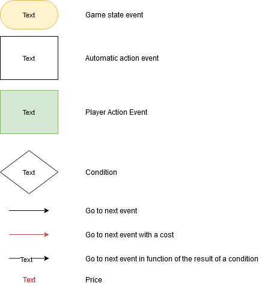
#### Hero
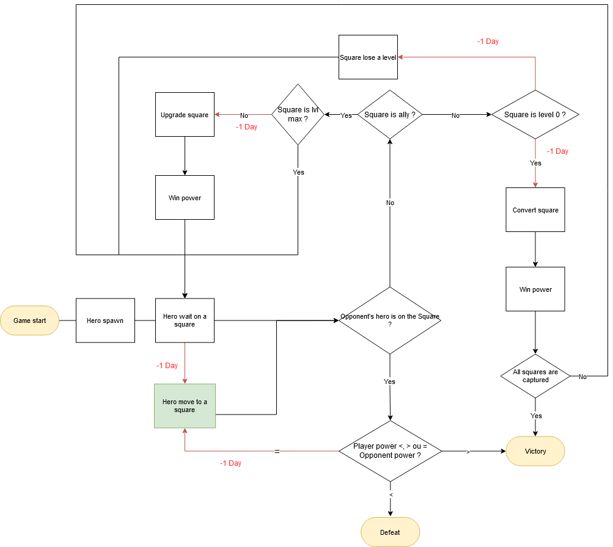
#### Square
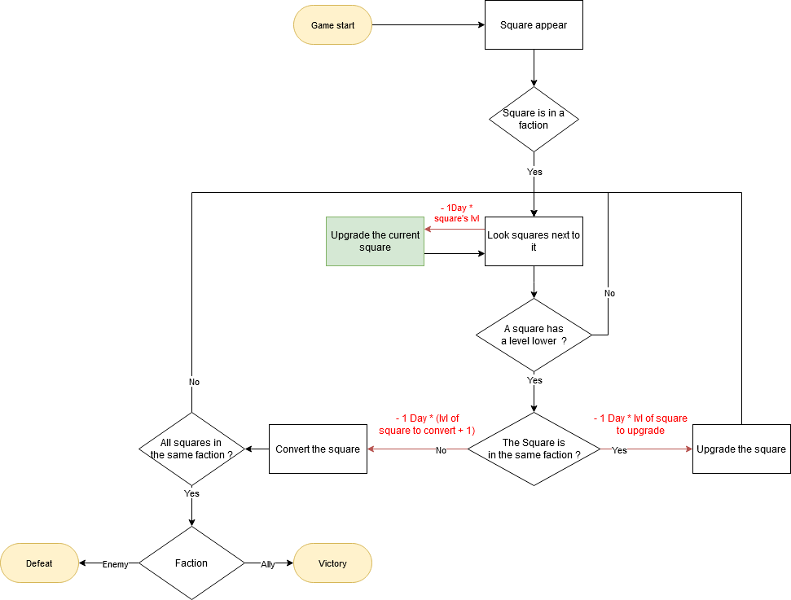

### UI
#### Interaction
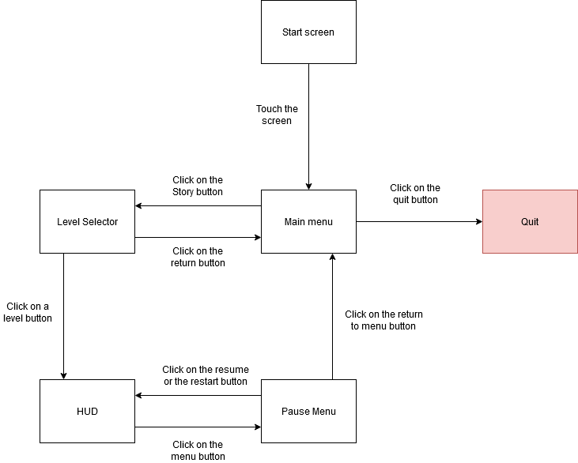
#### Legend
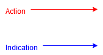
#### Start screen
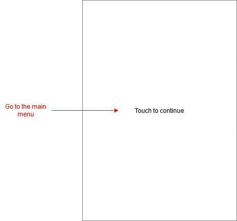
#### Main menu
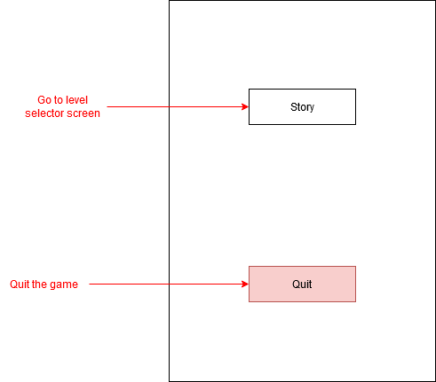
#### Level selector
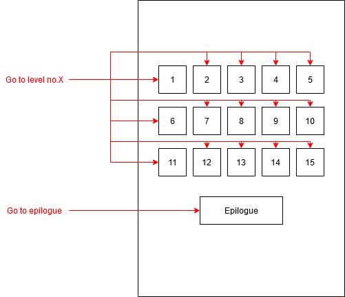
#### HUD
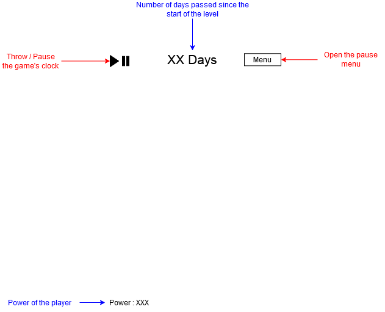
#### Pause menu
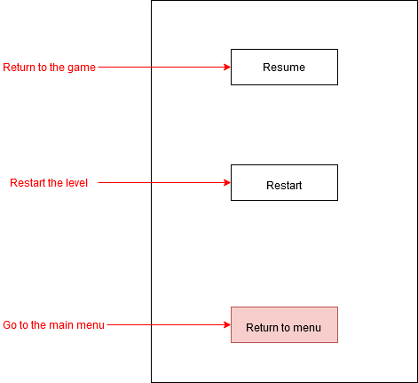

### Level design
#### LD Bricks
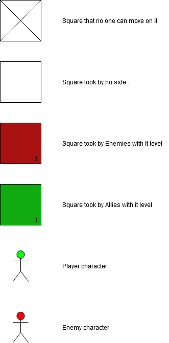
#### Level 1
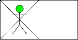
#### Level 2
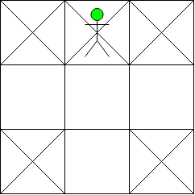
#### Level 3
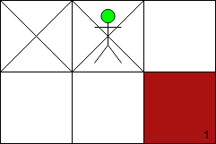
#### Level 4
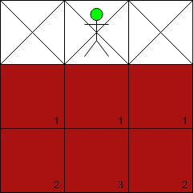
#### Level 5
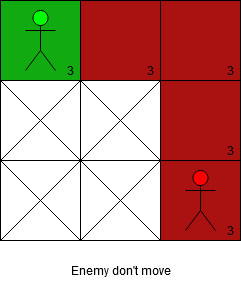
#### Level 6
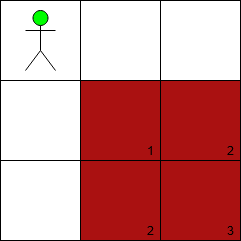
#### Level 7
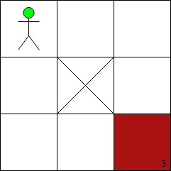
#### Level 8
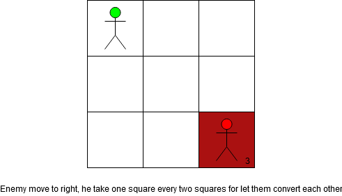
#### Level 9
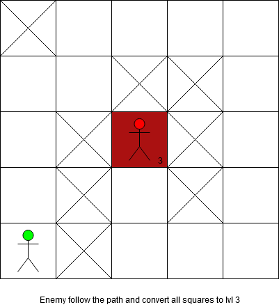
#### Level 10
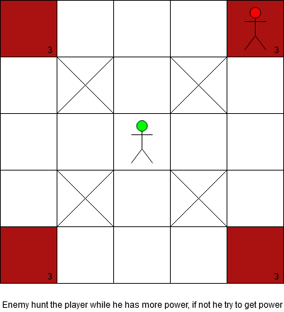
#### Level 11
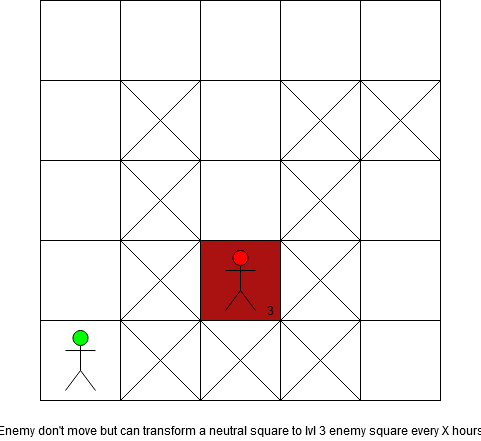
#### Level 12
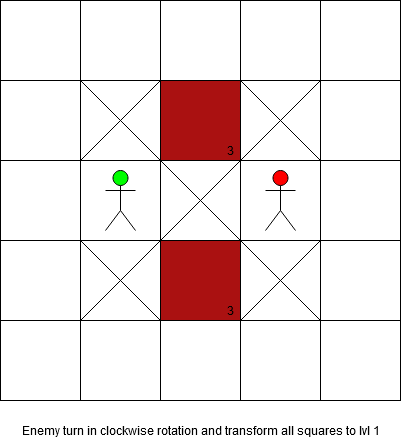
#### Level 13
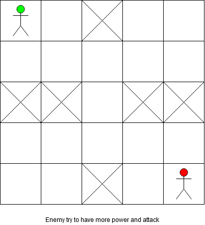
#### Level 14
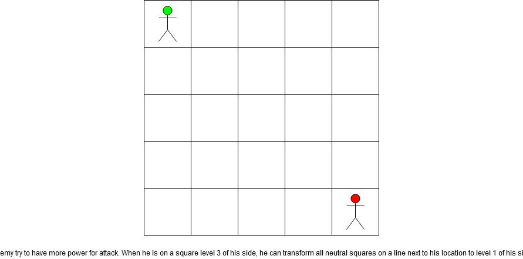
#### Level 15
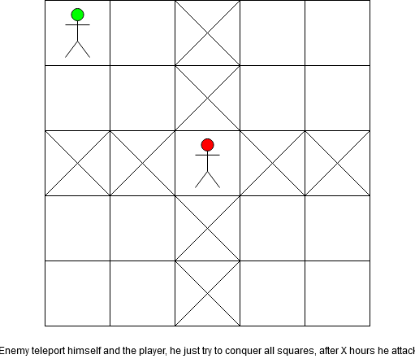
#### Epilogue
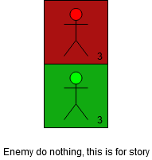