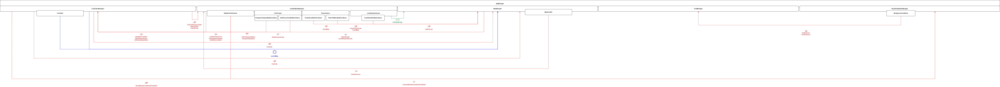
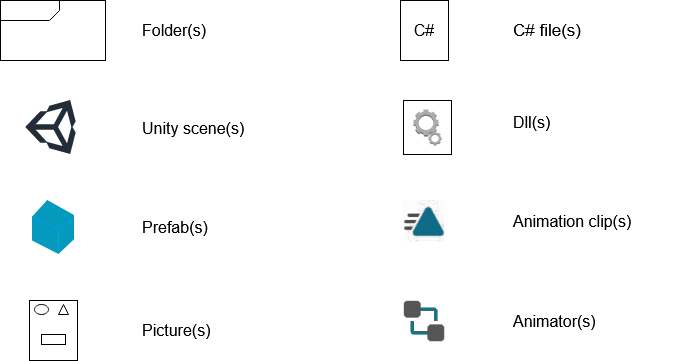
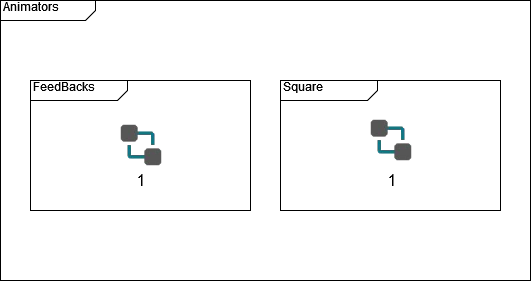
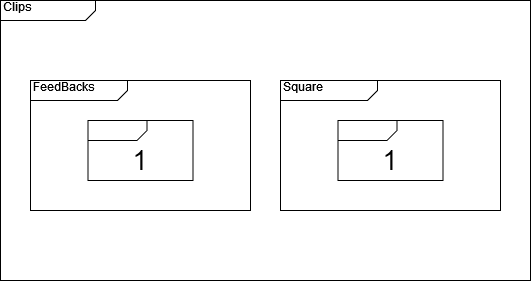
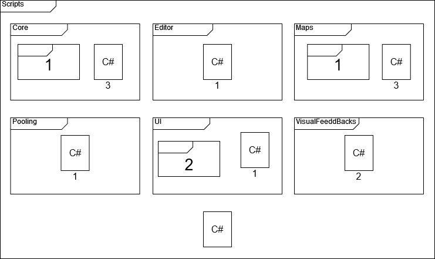
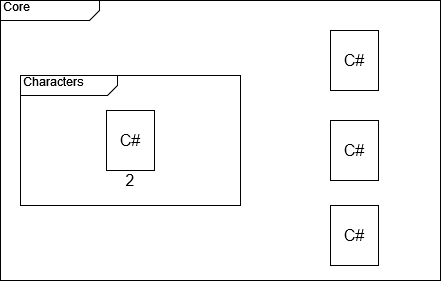
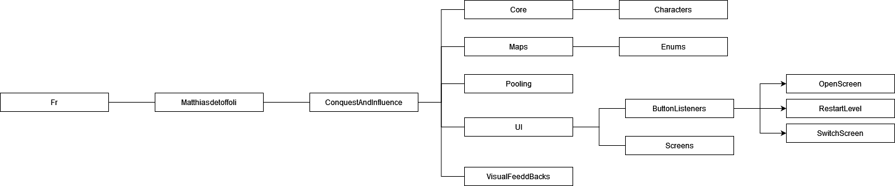

# Technical Design Document

## Contents
**I** *- Versions*

**II** *- About it*
* **A** *- Why this ?*
* **B** *- What is it ?*
	* *Victory condition*
	* *Defeat condition*
* **C** *- Platform target*
* **D** *- 3C*
	* *Camera*
	* *Controls*
	* *Character*

**III** *- Tools*
* **A** *- Research*
* **B** *- Software*
* **C** *- Language*
* **D** *- Libraries*

**IV** *- Project*
* **A** *- Model*
	* *Legend*
	* *Diagram*
* **B** *- Project structur*
	* *Legend*
	* *Assets*
		* *Animators*
		* *Clips*
			* *Feedbacks*
			* *Square*
		* *Scenes*
		* *Scripts*
			* *Maps*
			* *UI*
		* *Sprites*
* **C** *- Namespaces*
* **D** *- Coding rules*
	* *Using*
	* *Structure of a class or a struct*
	* *Singletons*
	* *Brackets*
	* *Regions*
	* *Methods*
	* *Comments*
	* *Variables*
	* *Strings*
	* *Values*
	* *Condition*
	* *Loops*
	* *Events*
	* *Nomenclature*
		* *Namespaces*
		* *Classes / Structs*
		* *Metodes*
		* *Constants*
		* *Properties*
		* *Events*
		* *Fields*
		* *Variables*
		* *Parameter*
		* *List, Array, Dictionary Etc*
		* *Enum*

**V** *- Hard points of the project*
* **A** *-Graphism and songs*
* **B** *-Unity 2D*
* **C** *-How to resolved this problems ?*
	* *Graphism and songs*
	* *Unity 2D*
	
## Versions
| VX.X | Date       | Title  													  | Comments																	 								     | Author              |
| ---- | ---------- | ----------------------------------------------------------- | ---------------------------------------------------------------------------------------------------------------- | ------------------- |
| V0.0 | 03/22/2020 | Creation of the documentation 							  | Create the document and add the summary, the coding, commit rules and about it parts							 | Matthias de Toffoli |
| V0.1 | 03/28/2020 | Add tools part			    							  | Add tools part and indicate researche, software, language and libraries subparts		   						 | Matthias de Toffoli |
| V0.2 | 04/04/2020 | Add Hard points, Model, Project structur and Namespaces part| Add Hard points, Model, Project structur and Namespaces part, adding diagrams and legends for the three last part| Matthias de Toffoli |
| V0.3 | 04/19/2020 | Modifications for correspond to the GDD					  | Modify the 3C parts and the conditions for win / lose (rename them Victory/Defeat conditions)					 | Matthias de Toffoli |
| V0.4 | 05/09/2020 | Change regions and add events parts						  | Write regions name in upper camelcase, and add events in codding rules											 | Matthias de Toffoli |
| V0.5 | 05/10/2020 | Update regions part and add constants region in it		  | Add rules for constants regions and update regions for allow subregions											 | Matthias de Toffoli |
| V0.6 | 05/16/2020 | Update Namespace part, and the coding rules				  | Add an exception for Editor folder in namespace part, and change some syntaxes in coding rules					 | Matthias de Toffoli |
| V1.0 | 10/25/2020 | Update the communication diagram							  | Update the communication diagram for match with the current project												 | Matthias de Toffoli |
| V1.1 | 10/31/2020 | Update the Folders diagrams								  | Update the folders diagram for match with the current project and change the unity version						 | Matthias de Toffoli |
| V1.2 | 11/01/2020 | Update the Namespaces diagrams							  | Update the Namespaces diagram for match with the current project and corect all namespaces references			 | Matthias de Toffoli |
| V1.3 | 11/28/2020 | Change some game rules 									  | Change some game rules for make it more easy for the player														 | Matthias de Toffoli |
| V1.4 | 04/08/2021 | Add a missing point										  | Add a missing skills for the character																			 | Matthias de Toffoli |
| V1.5 | 04/14/2021 | Update diagrams											  | Update some diagrams and add Core folder's diagram																 | Matthias de Toffoli |
| V1.6 | 07/22/2021 | Add background to some images	  							  | Add a white background to some images																	   		 | Matthias de Toffoli |
| V1.7 | 11/23/2021 | Update the diagrams 			  							  | Update the diagram for matching with the project files															 | Matthias de Toffoli |

## About it
### Why this ?
For improve my skills with unity 2D and made a game on my own.
### What is it ?
It's a 2D mobile mind break game, you will conquer a square that will influence the adjacent squares for conquer them too. An opponent will do same. Every square on your side will give you power, if you have more power than your opponent you will can defeat him.
#### Victory condition
The player conquer the all map or beat the opponent hero
#### Defeat condition
The opponent conquere the all map or beat the player hero
### Platform target
Android
### 3C
#### Camera
Fix 2D top-down
#### Control
Touch only
#### Character
* Move to a square point out
* Conquer an empty square
* Upgrade a square already conquered
* attack the opponent's hero

## Tools
### Research
No tool researchs was make for this project beause the goal is to improve my skills with Unity.
### Software
Unity 3D 2020.1.0f1
### Language
C# with .Net 4.6
### Libraries
will use my [global project code](https://github.com/MatthiasDeToffoli/GlobalUnityProjectLibrary "global project code") and [global unity project code](https://github.com/MatthiasDeToffoli/GlobalUnityProjectLibrary "global unity project code")'s libraries

## Project
### Model
Will use managers, they will manage their part and single objects will be managed only by them, a manager can communicate with another but never with objects which is manage by another manager.
#### Legend

#### Diagram

***This diagram don't show test scripts because they will be deleted at the end of the project***
### Project structur
#### Legend

#### Assets

##### Animations

###### Animators

###### Clips


* *Feedbacks*


* *Square*


##### Scenes

##### Scripts

###### Core

###### Maps

###### UI

##### Sprites

### Namespaces

### Coding rules
The main language of the project is english so all things has to be write in english (comments, names, classes, etc...)
#### Using
All usings are at top of the document and sorte by alphabetic order.
*It's more legible.*

#### Namespaces
One namespace by documents, the namespace start with Fr.Matthiasdetoffoli.ConquestAndInfluence and use folders name
without assets and scripts folders.
One exception for the folder Editor the namespace will finish by PersonalEditor, for not have conflict with UnityEngine.Editor.
*With this type of namespace it will be easyer to find files.*

#### Structurs of a class
In the class write first the constants followed by the events, the fields,  the properties, after that the constructors the methods and finally the classes/structs. 
```C#
MyClass 
{
	#region Constants
	#region Events
	#region Fields
	#region Properties
	#region Constructors
	#region Methods
	#region Objects
}
```
*more legible*

### Singletons
use it less as possible.
*use too much singletons is not a good practice*

#### Brackets
Open the Bracket at the bottom of the instruction and start a new line for close it.

```C#
Instruction() 
{
	…
}
```
If it's empty between the two brackets let them side by side
```C#
Instruction() { }
```
*More legible*

#### Regions
Only in a class, 7 principal regions :
* Constants : used for all the constant
* Events : used for all the event
* Fields : used for all private and protected fields
* Properties : used for all public properties (also if it have a private set)
* Constructors : used for all the constructors
* Methods : used for all methods, it will contained one subregion (the other methods will not be in another regions) :
	* Unity : used for all Unity's methods, 
* Objects : used for all classes and structures created in the current class
if you have nothing to put in the region don't write it, it's used only if you need it for exemple if you have methods used the region Methods but if you don't have property don't used the region Properties.
If you have many of methods link to a feature, you can add a subregion but only if it make your class more legible.
*More easier for find something in a class.*

#### Methods
Write in order of calling most as possible. Unity's methods are always after the personal methods.
*Easier to read and understand*

#### Comments
Comment most as possible,
for classes, metodes and properties use the summary
```C#
/// <summary>
/// ...
/// </summary>
///<param name="pName">...</param>
///<return>...</return>
```
complet all parts even if it's obvious (maybe it's not for others)
For comments in metodes use simple comments with //
don't write comments at the left of a line all comments has to be in it own line, let a blank line
before write a comment but not after.
```C#
code

//comments
code
```
*More legible*

#### Variables
All variables has to be create at the start of the function even for loop's variables don't let blank line
between two variable declaration (except if you have a comments before one of them) but let one
after all variables declarations.
You can declar some variables in the same line if no one is initialized in the declarations, always go to the
next line after an initizialition.
```C#
private void MyFunction () 
{
	int i,j = 0 ;
	int k ;
	string str ;
	//comments
	float l ;
	object obj ;
	l = 0,5f;
}
```
Never use var
*More legible*

#### Strings
Use strings metodes more than possible (string.format is better than str + str2)
*More performant*

#### Values
Never write a value directly like 
```C# if(lifeAnswer == 42)```
always write values in constant or variable
like 
```C# 
TRUE_ANSWER = 42; 
if (lifeAnswer == TRUE_ANSWER)
```
*More legible and efficiant if you have to change the value*

#### Condition
You can don't use brackets with a if, only if it's a value to set in the same line or before a loop like :

```C#
if(lMyInt == 17) 
	lMyIntIsSeventeen = true;
	
if(lCanUseLoop)
	for(i = 0, l = 3; i < l; i++) 
	{
		...
	}
```
Go to the next line before write else
It's possible to use ? But just one per line and for short conditions. (don't do var = test ? A : test2 ? B : C) use space around ? And around :
*More legible*

#### Loops
Use most as possible for loops, always use brackets with it
```C#
int i,l ;
for (i = 0, l = 3 ; i < l ; i++) 
{
	...
}
```
it's more easyer for make a reverse for loop
```C#
int i,l ;
for (i = 0, l = 3 ; i < l ; l--) 
{
	...
}
```
*More legible*

#### Events
Use .Invoke for call the event
```C#
public event Action MyEvent;

public FireMyEvent()
{
	if(MyEvent != null) 
		MyEvent.Invoke();
}
```

#### NOMENCLATURE
##### Folder
Upper camel case
*More legible.*
##### Namespaces
Like folders except Fr.Matthiasdetoffoli
*More legible*
##### Classes / Structs
Upper camel case
*More legible.*
##### Metodes
Upper camel case
*More legible.*
##### Constants
Write with capitale and every words separate with an underscore
*More legible.*
##### Properties
Lower camelcase
*More legible*
##### Events
Upper camel case
*More legible.*
##### Fields
mMyField
*More legible*
##### Variables
lMyVar;
*More legible*
##### Parameter
pMyParameter
*More legible*
##### List, Array, Dictionary Etc
Clarify list or array or what is it at the fine of the name
```C#
private List<int> mIntList ;
```
*More legible*
##### Enum
Write the name of the Enum  with upper camel case, all values will be wrote with majuscules and if it contain many words every words are seperate by an underscore.
```C#
MyEnum 
{
	VAL_1,
	VAL_2,
	VAL_3
}
```
*More legible*

### Commit Rules

#### Commit keys
For this project I will use a key word between *[]* followed by a short description 

* [ADD] for all commit conserning the adding of a new feature. *I will not use it inevitably when I add a new element in my project (scripts or stuff)*
* [UPDATE]  for all commit conserning the updating of an existing feature
* [FIX] for all commit conserning the fix of a feature
* [QUALITY] for all commit conserning quality (add a missing files, delete a useless file etc...)

I can add *.WIP* after the key for say it's not finished. If I do that the commit used when the featur will be finished will be the same without a WIP. That's mean a commit with the key *[ADD.WIP]* will be followed by a commit *[ADD]* when the feature will be finished.

#### master
I will push on master only finished features. The project have to always work on master. I will use other branches for my devellopments.

## Hard points of the project
### Graphism and songs 
I will do everything at first for improve my skills but I have not good skills with drawing and songs so it will be hard for me.
### Unity 2D
I didn't really used the 2D part of unity it will be a first time
### How to resolved this problems ?
#### Graphism and songs
Work hard and ask advice to artist friends
#### Unity 2D
tutorials and some research
